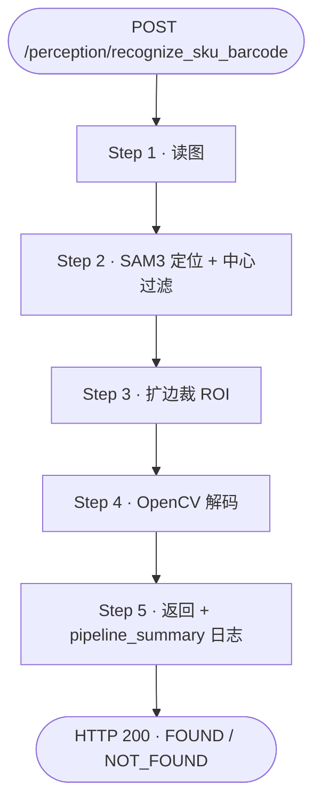
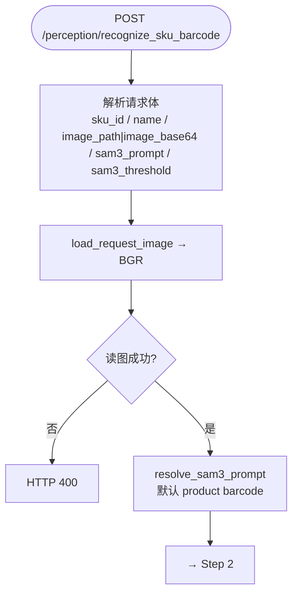
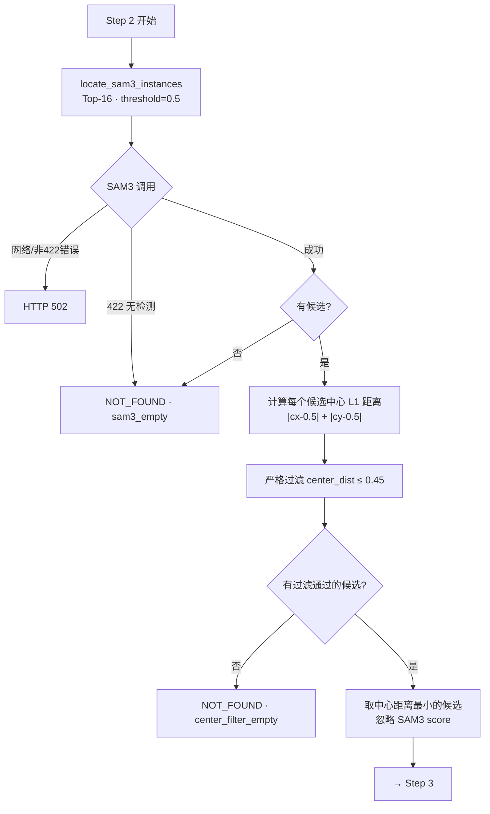
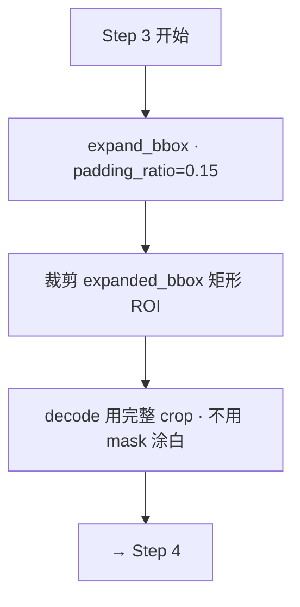
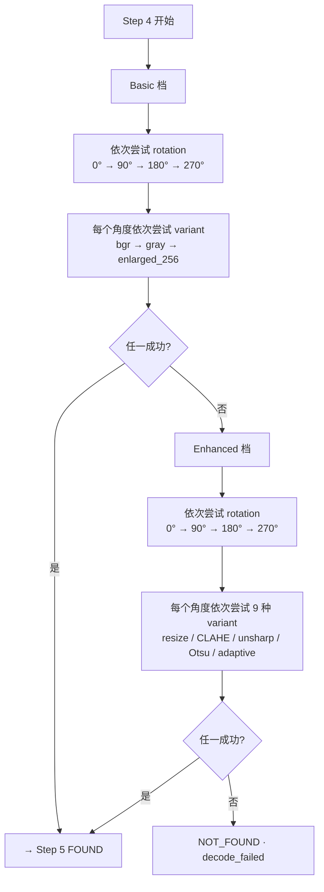
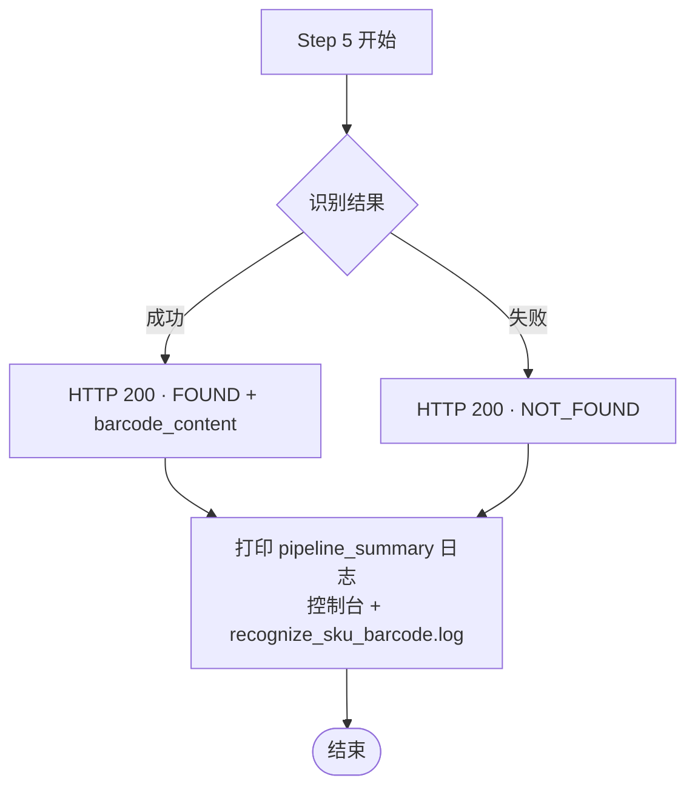

# 商品条码识别接口

## 1. 接口概览

| 项目 | 说明 |
|------|------|
| 路径 | `POST /perception/recognize_sku_barcode` |
| 服务 | 感知网关（`app.py`，默认 `:8083`） |
| 模块 | `api/sku_recognize.py` + `services/sku_recognize.py` |
| 场景 | 拣选、复核 |
| 功能 | 在指定 RGB 图片中识别商品 **一维条形码** 内容 |

**设计要点：**

- 内部集成 **SAM3 定位 + OpenCV 解码**，Agent 无需先调定位接口再调解码接口。
- 只返回识别到的条码字符串，**不校验**条码是否与 `sku_id` / `name` 匹配。
- `sku_id`、`name` 由 Agent 从任务/WMS 获取后透传，供链路上下文使用，不参与识别逻辑。

---

## 2. 请求

```http
POST /perception/recognize_sku_barcode
Content-Type: application/json
```

### 2.1 请求体

| 字段 | 类型 | 必填 | 默认值 | 说明 |
|------|------|------|--------|------|
| `sku_id` | string | 是 | — | 商品 ID（透传，不校验） |
| `name` | string | 是 | — | 商品名称（透传，不校验） |
| `image_path` | string | 二选一 | — | RGB 图片路径（服务端可访问的本地绝对/相对路径） |
| `image_base64` | string | 二选一 | — | RGB 图片 Base64；支持纯 Base64 或 `data:image/jpeg;base64,...` 形式 |
| `sam3_prompt` | string | 否 | `"product barcode"` | 覆盖 SAM3 文本 prompt（调试用） |
| `sam3_threshold` | float | 否 | `0.5` | SAM3 检测阈值，范围 `[0.0, 1.0]` |

`image_path` 与 `image_base64` **必须且只能提供一个**。传 `image_base64` 时无需挂载 `/shared` 卷，适合调用方与服务不在同一文件系统的场景。

### 2.2 请求示例

**方式 A — 本地路径（Docker 需挂载 `/shared`）：**

```json
{
  "sku_id": "sku_1",
  "name": "Estee Lauder 雅诗兰黛保湿莹润柔肤水 400ml",
  "image_path": "/shared/capture/sku_barcode.jpg"
}
```

**方式 B — Base64：**

```json
{
  "sku_id": "sku_1",
  "name": "Estee Lauder 雅诗兰黛保湿莹润柔肤水 400ml",
  "image_base64": "/9j/4AAQSkZJRg..."
}
```

---

## 3. 响应

### 3.1 识别成功 — HTTP 200

```json
{
  "status": "FOUND",
  "barcode_content": "6901234567890"
}
```

### 3.2 未识别到 — HTTP 200

```json
{
  "status": "NOT_FOUND"
}
```

| 字段 | 类型 | 说明 |
|------|------|------|
| `status` | `"FOUND"` \| `"NOT_FOUND"` | 是否成功解码出条码 |
| `barcode_content` | string \| null | 条码内容；`NOT_FOUND` 时为 `null` |

### 3.3 错误响应

| HTTP | detail 示例 | 原因 |
|------|-------------|------|
| 422 | `image_path 与 image_base64 必须且只能提供一个` | 请求体未提供图片，或两个字段同时提供 |
| 400 | `图片不存在: ...` | `image_path` 无效或文件不可读 |
| 400 | `无法读取图片: ...` | 图片格式损坏 |
| 400 | `图片 Base64 格式错误` | `image_base64` 不是合法 Base64 |
| 400 | `无法读取图片: Base64 内容不是有效图片` | Base64 解码成功但不是有效图片 |
| 502 | `SAM3 调用失败: ...` | SAM3 服务不可达、超时或非“无检测”类 HTTP 错误 |
| 502 | `SAM3 infer 响应缺少 detections 数组` | SAM3 返回格式异常 |
| 502 | `SAM3 infer 响应的 RLE mask 需要安装 pycocotools` | 缺少依赖 |

> SAM3 infer 返回 **422 / 无 valid detections** 时，内部视为“未定位到条码”，返回 **200 + NOT_FOUND**，不抛 502。  
> 未找到条码、SAM3 未定位到目标、或中心距离严格过滤后无候选时，同样返回 **200 + NOT_FOUND**，不返回 404。

---

## 4. 处理逻辑

### 4.1 流程总览

主链路（5 步）：



#### 4.1.1 Step 1 — API 入口与读图



#### 4.1.2 Step 2 — SAM3 定位与中心过滤



#### 4.1.3 Step 3 — 扩边裁 ROI



#### 4.1.4 Step 4 — OpenCV 条码解码



每个 variant 均调用 `cv2.barcode.BarcodeDetector().detectAndDecode()`（底层 ZBar）。**任一成功立即返回**，不继续后续 variant / rotation / tier。Enhanced 档 9 种 variant 经去重后实际数量可能略少。

#### 4.1.5 Step 5 — 返回与日志



**典型成功路径示例（175832238_rot000.jpg）：**

```
读图 (3.3ms) → SAM3 2 候选 → 中心过滤剩 1 个 → 扩边 15% 裁 ROI (70×226)
→ Basic / rotation=0 / variant=bgr → FOUND
```

### 4.2 步骤说明

#### Step 1 — 读图

- `image_path` 与 `image_base64` 二选一；请求校验失败 → **422**。
- 路径模式：调用 `load_image_from_path(image_path)` 读取 BGR 彩色图；路径不存在或解码失败 → **400**。
- Base64 模式：调用 `load_image_from_base64(image_base64)` 解码 BGR；格式错误或内容不是有效图片 → **400**。

#### Step 2 — SAM3 多实例条码定位

- 默认 prompt：`product barcode`（环境变量 `SUPERVISION_RECOGNIZE_SKU_BARCODE_PROMPT` 或请求体 `sam3_prompt`）。
- 调用 `locate_sam3_instances()`，最多保留 Top-16 个候选。
- 对每个候选计算 bbox 中心相对画面中心的 **L1 距离**（`|cx-0.5| + |cy-0.5|`，归一化到 `[0,1]`）。
- 默认过滤阈值 `0.45`（`config.py` 中 `RECOGNIZE_SKU_BARCODE_CENTER_DISTANCE_MAX`）：只保留距离 ≤ 阈值的候选，优先排除画面边缘的背景条码（如货架纸箱）。
- **严格模式**：若过滤后为空（包括 SAM3 只返回 1 条但偏离中心），直接返回 **NOT_FOUND**，不再 decode。
- 在通过过滤的候选中取 **最接近画面中心** 的一条 decode（中心距离最小）。

**SAM3 协议自动选择**（`clients/sam3_client.py`）：

| SAM3_URL 形式 | 协议 | 请求格式 |
|---------------|------|----------|
| 以 `/api/v1/segment` 结尾，如 `http://211.137.21.33:25541/api/v1/segment` | segment | multipart：`image` + `prompt` + `threshold` + `mask_threshold` |
| 以 `/infer` 结尾（旧版） | infer | JSON + `image_base64` |

segment 响应示例：

```json
{
  "prompt": "product barcode",
  "image": { "width": 1920, "height": 1080 },
  "threshold": 0.5,
  "mask_threshold": 0.5,
  "num_instances": 1,
  "instances": [
    {
      "instance_id": 0,
      "score": 0.98,
      "bbox_xyxy": [310.2, 88.4, 1211.5, 1049.3],
      "mask_png_base64": "iVBORw0KGgo..."
    }
  ]
}
```

`instances[].bbox_xyxy` 为浮点 xyxy，内部取整；`mask_png_base64` 解码为 PNG mask，尺寸不一致时会缩放到输入图大小。`num_instances=0` 或空 `instances` 视为未检测到目标。

infer（旧版）响应中 `detections[].bbox` 为 **xywh**，内部转换为 xyxy；`segmentation` 为 COCO RLE，用 `pycocotools` 解码为 mask。

#### Step 3 — 扩边裁 ROI

- 对 SAM3 `bbox` 按 `RECOGNIZE_SKU_BARCODE_BBOX_PADDING_RATIO`（默认 `0.15`）四向扩边，保留条码静区。
- 直接裁剪扩边后的矩形区域 decode，**不对 ROI 做 mask 涂白**（涂白常会裁掉竖向/曲面条码的有效条纹，导致误读）。

#### Step 4 — OpenCV 条码解码（Basic / Enhanced 两档）

- 使用 `cv2.barcode.BarcodeDetector().detectAndDecode()`（底层 ZBar）。
- 解码器对每个候选图逐个尝试，**任一成功即返回**，不继续后续候选。
- 在裁切后的 ROI 上解码；每个档位内再依次尝试 **0°、90°、180°、270°**，覆盖条码竖放、倒放。

**Basic 档（始终先跑，低开销）**

对应 `_preprocess_variants_basic()`，每个角度生成 2～3 张候选图：

| 顺序 | 候选图 | 说明 |
|------|--------|------|
| 1 | 原图 BGR | 清晰条码通常在此成功 |
| 2 | 灰度图 | 去除颜色干扰 |
| 3 | 长边 Lanczos 放大到 256 | 仅当 ROI 长边 < 256 时追加 |

**Enhanced 档（Basic 四轮均失败后启用）**

对应 `_preprocess_variants_enhanced()`，专门应对低分辨率、模糊、反光、对比度不足。每个角度生成约 7～9 张候选图（去重后），包括：

| 增强手段 | 说明 |
|----------|------|
| 512 / 1024 放大 | 比 Basic 更激进地提高 module 像素宽度 |
| CLAHE | 局部对比度增强，应对偏暗或局部反光 |
| Unsharp 锐化 | 强化条空边界，应对轻微模糊 |
| Otsu 二值化 | 全局自动阈值，输出纯黑白图 |
| Adaptive 二值化 | 局部自适应阈值，应对光照不均 |

**两档调用顺序**

```
裁切后的 ROI
  ├─ Basic:   0° → 90° → 180° → 270°
  └─ Enhanced: 0° → 90° → 180° → 270°   （仅 Basic 全失败后）
```

#### Step 5 — 返回

- 任一步解码成功 → `{ "status": "FOUND", "barcode_content": "..." }`
- 全部失败 → `{ "status": "NOT_FOUND" }`

### 4.3 关键代码位置

| 环节 | 文件 |
|------|------|
| HTTP 路由 | `api/sku_recognize.py` |
| 识别编排逻辑 | `services/sku_recognize.py` |
| 流程追踪与摘要日志 | `core/recognize_trace.py` |
| SAM3 客户端 | `clients/sam3_client.py` |
| ROI 裁切 / Basic+Enhanced 解码 | `services/qr_decode.py` |
| SAM3 prompt | `core/sam3_prompts.py` |
| 配置项 | `config.py` |

---

## 5. 环境与配置

### 5.1 SAM3 服务

```powershell
# segment 服务（当前默认）
$env:SAM3_URL = "http://211.137.21.33:25541/api/v1/segment"

# 旧版 infer 服务（兼容保留）
$env:SAM3_URL = "http://192.168.130.97:18004/infer"

# 显式指定协议（可选，通常按 URL 自动识别）
$env:SAM3_BACKEND = "segment"   # infer | segment
```

### 5.2 日志

| 配置项 | 默认值 | 说明 |
|--------|--------|------|
| `RECOGNIZE_SKU_BARCODE_LOG_PATH` | `logs/recognize_sku_barcode.log` | 流程日志文件路径 |

每次请求**结束时**打印一条 `pipeline_summary` 多行日志，汇总完整内部流程（与 §4.1 流程图一致）：读图、SAM3 各候选及 pass/reject、中心过滤、扩边裁 ROI、OpenCV decode 命中路径、耗时与最终结果。日志同时输出到 **控制台（uvicorn）** 和 **日志文件**。

示例：

```
step=pipeline_summary status=FOUND
request sku_id='test' name='test' image_source='path' image_path='...' sam3_prompt='product barcode' sam3_threshold=0.500
读图 (3.3ms)
  shape=1280x720
  ↓
SAM3 定位 (633.2ms) → 2 候选
  #1 score=0.8906 bbox=[775, 397, 829, 571] center_dist=0.299 pass
  #2 score=0.9062 bbox=[199, 457, 295, 504] center_dist=0.474 reject
  ↓
中心过滤 (0.45) → 剩 1 个 (#1, dist=0.299)
  ↓
扩边 15% 裁 ROI (70x226) bbox=[775, 397, 829, 571] expanded_bbox=[767, 371, 837, 597]
  ↓
OpenCV 解码 (9.2ms)
  basic / rotation=0 / variant=bgr → 成功 '3282779003131'
  ↓
FOUND: 3282779003131 (total_ms=667.6, timings_ms={...})
```

### 5.3 识别参数

默认值在 `config.py`：

| 配置项 | 默认值 | 说明 |
|--------|--------|------|
| `RECOGNIZE_SKU_BARCODE_CENTER_DISTANCE_MAX` | `0.45` | 条码 bbox 中心距画面中心的 L1 距离上限 |
| `RECOGNIZE_SKU_BARCODE_BBOX_PADDING_RATIO` | `0.15` | decode 前 bbox 四向扩边比例 |

可通过环境变量覆盖（无需改代码）：

```powershell
$env:RECOGNIZE_SKU_BARCODE_CENTER_DISTANCE_MAX = "0.45"
$env:RECOGNIZE_SKU_BARCODE_BBOX_PADDING_RATIO = "0.15"
```

### 5.4 Prompt 覆盖

```powershell
$env:SUPERVISION_RECOGNIZE_SKU_BARCODE_PROMPT = "product barcode"
```

### 5.5 依赖

- `opencv-python-headless`（含 `cv2.barcode` 模块）
- `pycocotools`（infer 后端解码 RLE mask 时需要）
- `requests`

---

## 6. 调用示例

### 6.1 curl

```bash
curl -X POST "http://127.0.0.1:8083/perception/recognize_sku_barcode" \
  -H "Content-Type: application/json" \
  -d '{
    "sku_id": "sku_1",
    "name": "测试商品",
    "image_path": "/shared/capture/sku_barcode.jpg"
  }'
```

### 6.2 Python

```python
import base64
from pathlib import Path

import requests

# 方式 A：本地路径
response = requests.post(
    "http://127.0.0.1:8083/perception/recognize_sku_barcode",
    json={
        "sku_id": "sku_1",
        "name": "测试商品",
        "image_path": "/shared/capture/sku_barcode.jpg",
    },
    timeout=120,
)

# 方式 B：Base64
image_bytes = Path("sku_barcode.jpg").read_bytes()
response = requests.post(
    "http://127.0.0.1:8083/perception/recognize_sku_barcode",
    json={
        "sku_id": "sku_1",
        "name": "测试商品",
        "image_base64": base64.b64encode(image_bytes).decode("ascii"),
    },
    timeout=120,
)
response.raise_for_status()
print(response.json())
```

---

## 7. 与其他接口的区别

| 接口 | 定位 | 解码 | 校验商品 |
|------|------|------|----------|
| `POST /perception/locate_sku_qr_code` | SAM3 | 无 | 无 |
| `POST /perception/parse_qr_code` | 无（需传入 bbox+mask） | OpenCV QR/条码 | 无 |
| **`POST /perception/recognize_sku_barcode`** | **SAM3** | **OpenCV 一维条码** | **无** |

本接口 = `locate_sku_qr_code` 的定位能力 + 条码专用解码 + 0°/90°/180°/270° 旋转兜底 + Basic/Enhanced 两档预处理，一步完成。

---

## 8. 注意事项

1. **只识别一维条形码**，不是二维码；二维码场景请用 `parse_qr_code` 或 `locate_sku_qr_code` + `parse_qr_code`。
2. **`sku_id` / `name` 不参与识别**，如需比对条码与任务商品是否一致，由 Agent 侧完成。
3. **图片质量**：条码清晰、尽量正对相机时识别率最高，通常 Basic 档即可成功；低分辨率或对比度不足时会自动进入 Enhanced 经典增强兜底，大角度斜拍依赖 90° 步长 rotation 兜底，不保证 100% 成功。
4. **SAM3 必须先可用**，否则会返回 502；启动 perception 前请确认 `SAM3_URL` 指向可达的 SAM3 服务。
